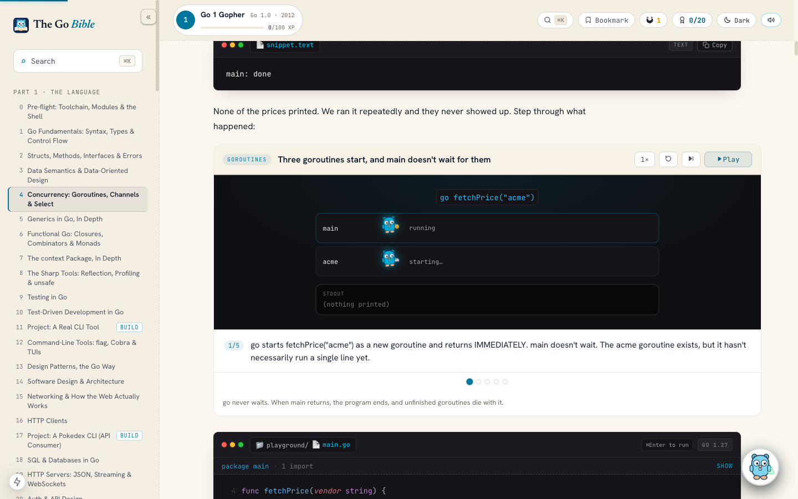
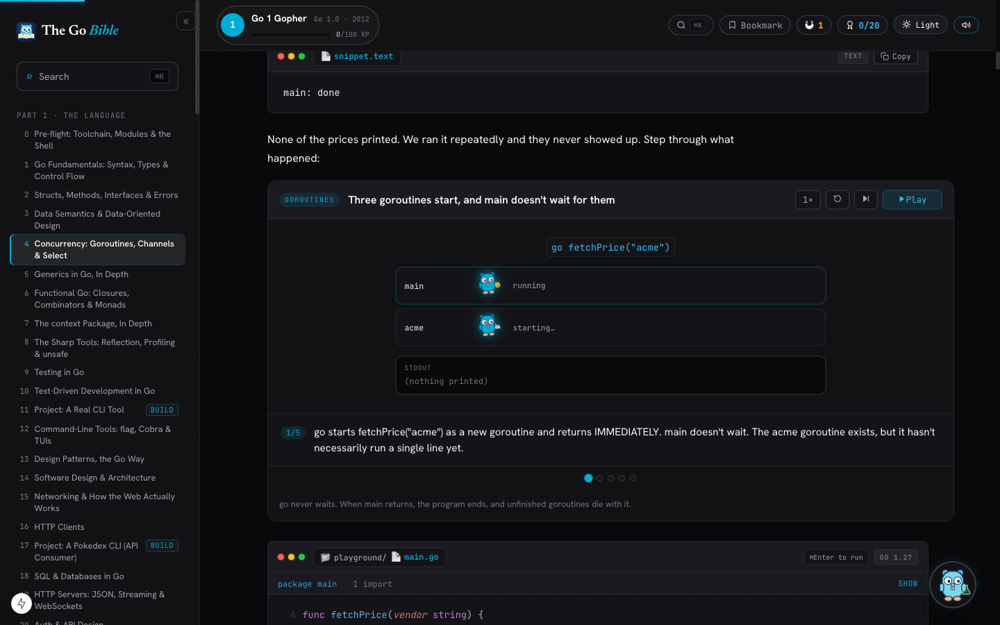
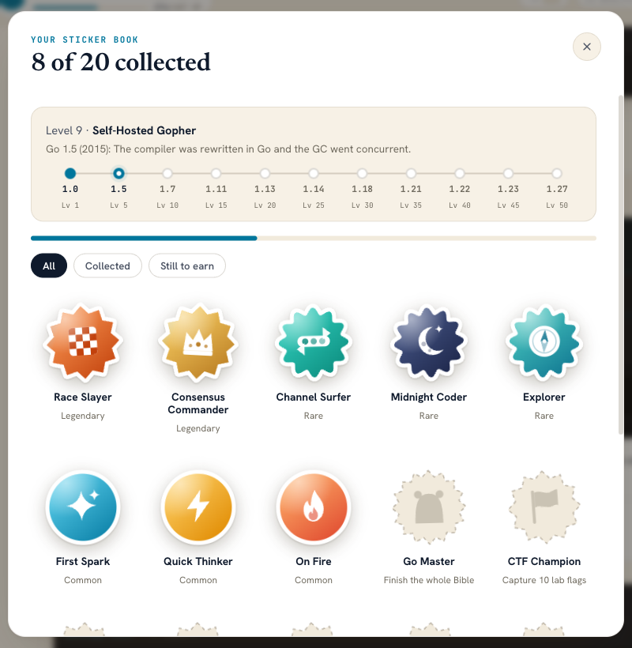

<p align="center">
  
</p>

<h1 align="center">The Go Bible</h1>

<p align="center">
  <b>A visual, verified course for learning Go properly: from your first <code>package main</code> to distributed systems and fintech.</b><br>
  Every mechanism is animated before it is coded, and the code is built and run on Go 1.27.
</p>

<p align="center">
  
  
  
  
  
</p>

<p align="center">
  
</p>

---

## What this is

**The Go Bible** is an interactive Go course built with Next.js, React and MDX. It is written to be read slowly:

- **A route map for every chapter.** Each chapter opens with its stops, says *Stop N of M* at every section, and breaks each mechanism into numbered steps: one idea per step, the picture before the code.
- **Animations of the real domain.** Scheduling happens in a bank hall, seat booking in a cinema auditorium, background jobs in a post room, and goroutines are gophers you can step through frame by frame.
- **Real programs, real output.** Examples are complete programs against real dependencies (Postgres, Redis Cluster, etcd, Pebble, Asynq, River and so on) and the output shown is the output they produced. No `foo`/`bar`, no `...` elisions, no mocked results.
- **Verified on Go 1.27.** A snippet runner builds and runs the code in every chapter, and each chapter shows a badge with how many of its programs build and when they were last checked.
- **Labs that prove themselves.** Every lab ships a starter that fails and a fix that passes, also under `GOMAXPROCS=1`, and CI-style scripts check both.
- **Where the rebuild stands.** Parts 1 and 2 (except the security chapter) and the first infrastructure chapter are rebuilt to this standard. Part 3 and the appendix are next.
- **Runnable in the browser.** Code blocks run in a Go sandbox via [Codapi](https://codapi.org/); GoLens explains a line's syntax when you hover it.

## The tracks (121 chapters)

| Track | What you build and learn | Chapters |
| :--- | :--- | :---: |
| **Part 1: The Language** | Syntax and types, value semantics, interfaces and errors, goroutines and channels, generics, context, testing and TDD, HTTP clients and servers, SQL, auth, caching, microservices, Docker, static binaries, deployment | **28** |
| **Part 2: Production Engineering** | The runtime scheduler, correctness under concurrency, a multi-replica cinema booking service, debugging, performance, observability, reliability with injected faults, background jobs, config, architecture, gRPC, MCP, replication, sharding on Redis Cluster, storage engines (Pebble, bbolt, Parquet), partial failures and clocks, consensus on a real etcd cluster | **24** |
| **Part 3: Fintech** | Exact money, double-entry ledgers, transactions and consistency, idempotency, messaging and event buses, Kafka, Watermill, external payment systems, auditability, batch processing, security, resilience under load, a capstone | **15** |
| **Part 4: Infrastructure** | Containers from scratch: namespaces, cgroups and layers in Go (more chapters in progress) | **1** |
| **Appendix** | DS&A and interview prep, common Go mistakes, web security, eBPF, fencing locks, zero-allocation systems, Wasm/WASI, Kubernetes operators, ReBAC/OpenFGA, ent, SSH servers, geospatial dispatch, AI agents, MCP platforms, vector databases, Temporal, NATS JetStream, OpenTelemetry processors | **53** |

## Reading experience

<p align="center">
  
  
</p>

- **Warm paper by default, dark one click away.** Code windows and animation stages stay dark on both themes, like screens set into the page. The choice is remembered and applied before the first paint.
- **Levels named after Go's history.** Your level climbs through Go releases, from the Go 1 compatibility promise (2012) through the self-hosted compiler, modules, generics and iterators to Go 1.27. Each era says what that release changed.
- **A sticker book.** Twenty die-cut stickers for running code, answering quick checks, capturing lab flags, keeping a streak and finishing chapters. Rarer stickers are scalloped or starburst-cut with a holographic foil, and each collected sticker carries a piece of Go history.
- **Reader tools.** Search (⌘K), a bookmark ribbon that returns you to the exact spot, reading progress, zen mode, adjustable font size and a scratchpad sandbox.

## Getting started

Requires Node.js 20+ and pnpm.

```bash
git clone https://github.com/Oyetomi/golang-bible.git
cd golang-bible
pnpm install
pnpm dev          # http://localhost:3000
```

### Checks

```bash
pnpm typecheck        # TypeScript
pnpm validate         # manifest and chapter structure
pnpm lint-mdx         # compile-check every MDX chapter
pnpm verify:snippets  # build and run the Go code in the chapters
pnpm verify:labs      # every lab: starter fails, fix passes
pnpm verify           # typecheck + validate + lint-mdx + snippets
pnpm build            # search index + static site
```

## Repository layout

```
golang-bible/
├── content/                  # the book
│   ├── part-1/ … part-4/     # chapters as MDX
│   ├── appendix/
│   ├── _manifest.json        # routes, order and prerequisites
│   ├── _REBUILD_STANDARD.md  # how a chapter is written and verified
│   └── _verified.json        # per-chapter build results and toolchain
├── app/                      # Next.js App Router: layout, pages, icon, theme
├── components/
│   ├── course/               # animations (CinemaAnim, BankAnim, PostRoomAnim, RuntimeStage…), playgrounds, labs, quizzes, the gopher
│   ├── gamification/         # header, sticker book, stickers, companion
│   └── nav/                  # sidebar, bookmarks, reading progress
├── lib/                      # content loading, Go eras and stickers, sound, search
└── scripts/                  # snippet runner, lab verifier, validators, search index
```

## Credits

The gopher mascot is inspired by the Go gopher, designed by [Renée French](https://reneefrench.blogspot.com/) and licensed under CC BY 4.0.

<p align="center">
  <sub>For engineers who want to understand what their Go is actually doing.</sub>
</p>
