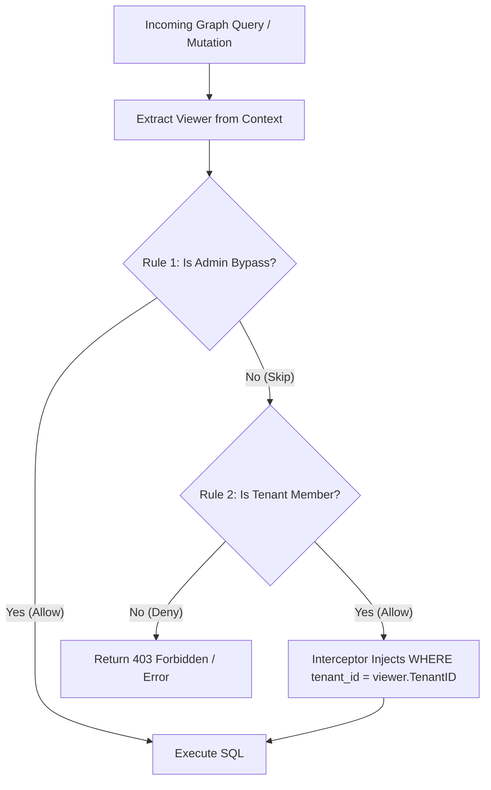

<HeroCard label="Appendix · Modern Graph ORMs" title="Modern Graph ORMs: ent, Privacy Policies & Dataloaders in Go">

Here's the thing, sport. Most Go developers think an ORM is just a slow reflection wrapper that turns `SELECT * FROM users` into a runtime panic waiting to happen. They dump GORM or raw SQL queries with string concatenation across five hundred HTTP handlers, forget a tenant check on line 42, and accidentally hand an entire bank account ledger to an unauthorized caller.

At **Meridian Bank**, we don't gamble with financial data or security compliance. When managing millions of organizations, compliance controls, ledger accounts, and audit events, we treat our database as what it truly is: **a connected relational graph**.

Following the battle-tested **Openlane architectural pattern**, we combine Facebook's code-generated **`ent`** graph framework, schema mixins, automated row-level **Privacy Policies & Interceptors**, schema-first **`gqlgen`**, and high-performance **batched DataLoaders**. 

No reflection. Zero string-based query vulnerabilities. Automated tenant isolation enforced on every query before SQL touches the wire. And zero N+1 database connection pool starvation. Today, you're learning how world-class Go backend engineers build bulletproof, ultra-high-throughput graph persistence layers.

</HeroCard>

<ChapterTabs tabs={["Ent: Code-Generated Graph Schemas", "Privacy Policies & Tenant Isolation Interceptors", "Schema-First GraphQL with gqlgen", "The N+1 Problem & Batched Dataloaders"]} />

<SpacedRecall
  role={"architect"}
  items={[
    {
      from: "Relational Databases & SQL Drivers (part 2, ch08)",
      q: "Why do reflection-based ORMs introduce severe runtime overhead in high-throughput Go backends?",
      options: [
        "They allocate interface{} values on the heap and scan fields via runtime reflection instead of compile-time struct offsets",
        "They bypass the PostgreSQL binary wire protocol",
        "They force the database engine to disable indexing",
        "They cannot execute transactions"
      ],
      answer: 0,
      tie: "Reflection-based scanning inspects struct tags and types on every row, generating massive heap churn and GC mark-assist pressure. Code-generated ORMs like ent assign fields directly at compile time."
    },
    {
      from: "Context Propagation & Concurrency (part 1, ch04)",
      q: "How should authentication tokens and tenant identities be propagated through graph traversals in Go?",
      options: [
        "Via package-level global variables",
        "Thread-local storage via unsafe pointers",
        "Immutable context.Context values (e.g. ViewerCtx) passed as the first parameter to every query and mutation",
        "HTTP header strings stored in database rows"
      ],
      answer: 2,
      tie: "Go contexts carry scoped, request-lifecycle metadata (Viewer ID, Tenant ID, permissions) across goroutines and interceptors deterministically."
    },
    {
      from: "Advanced Generics & Data Pipelines (part 1, ch05)",
      q: "What Go 1.26 feature enables type-safe batching without interface{} boxing?",
      options: [
        "Generic type constraints Loader[K comparable, V any]",
        "Dynamic type assertions at runtime",
        "Cgo pointer casts",
        "Unsafe string headers"
      ],
      answer: 0,
      tie: "Generic dataloaders guarantee type safety for keys and entities at compile time with zero boxing allocations."
    }
  ]}
/>

<PredictLab
  prompt={"When a GraphQL resolver requests 100 organization nodes and resolves each organization's ledger accounts without a DataLoader, what happens to the database connection pool?"}
  role={"operator"}
  code={`package main

import "fmt"

func main() {
	orgCount := 100
	// Naive nested resolver: 1 query for orgs + 1 query per org for accounts
	totalQueries := 1 + orgCount
	fmt.Printf("Executed SQL queries: %d\\n", totalQueries)
}`}
  options={[
    "1 single combined SQL query is executed automatically",
    "101 separate SQL queries saturate the connection pool (N+1 query explosion)",
    "The Go runtime batches the network packets automatically",
    "PostgreSQL caches all 100 queries in a single round-trip"
  ]}
  answer={1}
  output={`Executed SQL queries: 101`}
  explain={"Without DataLoader batching, nested GraphQL field resolvers execute independently across goroutines. Querying 100 organizations executes 1 query for the parent list followed by 100 distinct SELECT * FROM accounts WHERE org_id = $1 queries — exhausting database pool connections and spiking latency."}
/>

<Scene
  title="The N+1 Query Explosion vs Batched DataLoader"
  actors={[
    { id: "graphql", label: "GraphQL Engine", role: "captain" },
    { id: "resolver", label: "Field Resolvers", role: "operator" },
    { id: "loader", label: "DataLoader Batcher", role: "guard" },
    { id: "db", label: "Postgres Pool (max 20 conn)", role: "system" }
  ]}
  rows={2}
  cols={3}
  frames={[
    {
      caption: "NAIVE EXECUTION: Client requests 50 Organizations and their Ledger Accounts. GraphQL dispatches 1 SQL query for Org list, then fires 50 concurrent goroutines.",
      beat: "problem",
      cells: [
        { id: "A1", state: "bad", label: "50 Resolvers Active" },
        { id: "A2", state: "bad", label: "50 Individual SELECTs" },
        { id: "A3", state: "bad", label: "DB Pool Exhausted (100%)" }
      ]
    },
    {
      caption: "BOTTLENECK: The 20-connection pool is starved. 30 queries stall in wait queues. p99 tail latency spikes to 850ms. Database CPU surges due to query parsing overhead.",
      beat: "problem",
      cells: [
        { id: "B1", state: "bad", label: "Resolver Timeout Risk" },
        { id: "B2", state: "bad", label: "Queue Lag: 600ms" },
        { id: "B3", state: "bad", label: "Connection Churn" }
      ]
    },
    {
      caption: "DATALOADER SOLUTION: Resolvers submit 50 OrgIDs to the batcher. On tick flush, exactly 1 query executes: SELECT * FROM accounts WHERE org_id IN ($1..$50). Latency drops to 3ms.",
      beat: "solution",
      cells: [
        { id: "C1", state: "done", label: "50 Keys Aggregated" },
        { id: "C2", state: "done", label: "1 Batched SQL Query" },
        { id: "C3", state: "done", label: "DB Pool Idle (1 Conn Used)" }
      ]
    }
  ]}
  caption="The DataLoader pattern turns uncoordinated O(N) database queries into a deterministic O(1) batched round-trip."
/>

---

## Ent: Code-Generated Graph Schemas

In traditional relational ORMs like Hibernate, ActiveRecord, or GORM, models are defined as plain structs annotated with string tags. Querying relationships involves string-based joins (`db.Joins("Accounts").Where("balance > ?", 100)`). If you misspell a column name or refactor a foreign key, the compiler is silent. You only discover the bug at 2:00 AM when production throws a SQL syntax error.

Facebook created **`ent`** (`entgo.io/ent`) to model database entities as a **directed graph of Nodes and Edges**, with 100% compile-time type safety.

<Define term="Ent">
**`ent`** is a code-generated graph entity framework for Go. Schemas are written as pure Go code that `entc` (the Ent compiler) parses to generate statically typed client APIs, query builders, mutation structs, and SQL predicates with zero runtime reflection.
</Define>

<Define term="Graph Schema">
A **Graph Schema** represents a database domain model where tables are **Nodes** (e.g. `Organization`, `Account`, `Transaction`) and foreign keys/join tables are directed **Edges** (e.g. `Organization -> Accounts`, `Account -> Transactions`).
</Define>

<Define term="Schema Mixin">
A **Schema Mixin** is a reusable Go struct that embeds common fields, edges, indexes, hooks, and privacy policies into multiple entity schemas (such as audit timestamps, UUID primary keys, soft-deletes, and tenant IDs).
</Define>

### Modeling Nodes and Edges in Ent

Let's look at how Meridian models an `Organization` and an `Account` in pure Go schema files:

```go
// ent/schema/organization.go
package schema

import (
	"entgo.io/ent"
	"entgo.io/ent/schema/edge"
	"entgo.io/ent/schema/field"
	"entgo.io/ent/schema/mixin"
	"github.com/google/uuid"
)

type Organization struct {
	ent.Schema
}

func (Organization) Mixin() []ent.Mixin {
	return []ent.Mixin{
		TimeMixin{},
		TenantMixin{},
	}
}

func (Organization) Fields() []ent.Field {
	return []ent.Field{
		field.UUID("id", uuid.UUID{}).
			Default(uuid.New).
			Immutable(),
		field.String("name").
			NotEmpty().
			MaxLen(128),
		field.Enum("status").
			Values("ACTIVE", "SUSPENDED", "PENDING").
			Default("PENDING"),
	}
}

func (Organization) Edges() []ent.Edge {
	return []ent.Edge{
		// O2M: One Organization has many Accounts
		edge.To("accounts", Account.Type),
	}
}
```

And the child node `Account`:

```go
// ent/schema/account.go
package schema

import (
	"entgo.io/ent"
	"entgo.io/ent/schema/edge"
	"entgo.io/ent/schema/field"
	"github.com/google/uuid"
)

type Account struct {
	ent.Schema
}

func (Account) Mixin() []ent.Mixin {
	return []ent.Mixin{
		TimeMixin{},
		TenantMixin{},
	}
}

func (Account) Fields() []ent.Field {
	return []ent.Field{
		field.UUID("id", uuid.UUID{}).
			Default(uuid.New).
			Immutable(),
		field.String("account_number").
			Unique().
			NotEmpty(),
		field.Int64("balance_cents").
			Default(0),
		field.String("currency").
			Default("USD"),
		field.UUID("organization_id", uuid.UUID{}),
	}
}

func (Account) Edges() []ent.Edge {
	return []ent.Edge{
		// M2O: Many Accounts belong to one Organization
		edge.From("organization", Organization.Type).
			Ref("accounts").
			Field("organization_id").
			Unique().
			Required(),
	}
}
```

### The Schema Mixin Pattern

Notice how both schemas declare `TimeMixin{}` and `TenantMixin{}`. In the **Openlane architecture**, mixins enforce regulatory standards across every table in the database:

```go
// ent/schema/mixin.go
package schema

import (
	"time"

	"entgo.io/ent"
	"entgo.io/ent/schema/field"
	"entgo.io/ent/schema/mixin"
	"github.com/google/uuid"
)

// TimeMixin injects created_at and updated_at timestamps.
type TimeMixin struct {
	mixin.Schema
}

func (TimeMixin) Fields() []ent.Field {
	return []ent.Field{
		field.Time("created_at").
			Default(time.Now).
			Immutable(),
		field.Time("updated_at").
			Default(time.Now).
			UpdateDefault(time.Now),
	}
}

// TenantMixin guarantees every row belongs to an Organization.
type TenantMixin struct {
	mixin.Schema
}

func (TenantMixin) Fields() []ent.Field {
	return []ent.Field{
		field.UUID("tenant_id", uuid.UUID{}).
			Immutable().
			Comment("Strict tenant isolation scope"),
	}
}
```

<BeforeAfter
  bad={`// GORM / Naive String Reflection:
var accounts []Account
err := db.Where("org_id = ? AND blance > ?", orgID, 1000).
    Preload("Trnasactions").
    Find(&accounts).Error
// 1. Typos ("blance", "Trnasactions") compile fine!
// 2. Reflection overhead on every row scan.
// 3. Foreign key traversal is stringly-typed.`}
  good={`// Ent Generated Graph Traversal:
accounts, err := client.Organization.
    Query().
    Where(organization.IDEQ(orgID)).
    QueryAccounts().
    Where(account.BalanceCentsGT(1000)).
    WithTransactions().
    All(ctx)
// 1. 100% compile-time type checked.
// 2. 0 runtime reflection.
// 3. Graph traversal matches domain model.`}
  badLabel="Stringly-Typed Reflection ORM"
  goodLabel="Type-Safe Code-Generated Ent Graph"
/>

<UnderTheHood title="Ent AST Code Generation, Predicates & SQL Dialect Translation">

How does `ent` generate zero-reflection code?

1. **AST Schema Parsing**: When you run `go generate ./ent`, `entc` uses Go's `go/parser` and `go/ast` packages to inspect your `ent/schema/*.go` files. It evaluates the schema definitions in an isolated sandbox and builds an internal Abstract Syntax Tree representing all Nodes, Fields, Mixins, Edges, Indexes, and Constraints.
2. **Intermediate Representation (IR)**: The AST is transformed into an IR graph that resolves bidirectional edges (`edge.To` / `edge.From`), establishes foreign key cascades, and generates storage column mappings.
3. **Template Code Generation**: `entc` executes Go templates (`text/template`) against the IR. For each entity `Foo`, it emits:
   - `ent/foo.go`: The concrete struct definition with native Go types (`string`, `uuid.UUID`, `int64`).
   - `ent/foo_query.go`: Statically typed builder methods (`Query()`, `Where()`, `Select()`, `Limit()`).
   - `ent/foo/where.go`: Predicate generators (`IDEQ(id)`, `NameHasPrefix(p)`, `BalanceGT(val)`).
   - `ent/foo_create.go`, `ent/foo_update.go`, `ent/foo_delete.go`: Mutation builders.
4. **SQL Predicate Translation**: Predicates are not string formatters; they are closures accepting a `*sql.Selector`:
   ```go
   func BalanceCentsGT(v int64) predicate.Account {
       return func(s *sql.Selector) {
           s.Where(sql.GT(s.C(FieldBalanceCents), v))
       }
   }
   ```
5. **Zero-Reflection Row Scanning**: In generated `scanValues` methods, `ent` passes pointers directly to the driver (`&account.ID`, `&account.BalanceCents`, `&account.TenantID`). The `database/sql` driver populates memory offsets directly.
6. **Go 1.26 GC Impact**: Because struct offsets are fixed at compile time and no `reflect.ValueOf` boxing occurs, zero intermediate `interface{}` descriptors escape to the heap. On Go 1.26, struct instantiations reuse Green Tea GC allocation arenas with near-zero allocation overhead.

</UnderTheHood>

Let's see this in action. Below is a runnable graph store engine demonstrating code-generated node traversal and mixins in pure Go:

<GoPlayground>

```go
package main

import (
	"context"
	"fmt"
	"time"
)

// Simulating Ent's Graph Nodes and Traversal Engine

type Organization struct {
	ID        string
	Name      string
	TenantID  string
	CreatedAt time.Time
}

type Account struct {
	ID           string
	OrgID        string
	TenantID     string
	Name         string
	BalanceCents int64
}

type Transaction struct {
	ID          string
	AccountID   string
	AmountCents int64
	Description string
}

// In-memory Graph Database Storage
type GraphStore struct {
	orgs         map[string]Organization
	accounts     map[string][]Account
	transactions map[string][]Transaction
}

func NewGraphStore() *GraphStore {
	return &GraphStore{
		orgs:         make(map[string]Organization),
		accounts:     make(map[string][]Account),
		transactions: make(map[string][]Transaction),
	}
}

// Fluent Type-Safe Query Builder Pattern (Identical to Ent's generated API)
type OrgQuery struct {
	store *GraphStore
	orgID string
}

func (q *OrgQuery) QueryAccounts() *AccountQuery {
	accs := q.store.accounts[q.orgID]
	return &AccountQuery{store: q.store, accounts: accs}
}

type AccountQuery struct {
	store    *GraphStore
	accounts []Account
}

func (q *AccountQuery) WhereBalanceGT(minCents int64) *AccountQuery {
	var filtered []Account
	for _, a := range q.accounts {
		if a.BalanceCents > minCents {
			filtered = append(filtered, a)
		}
	}
	q.accounts = filtered
	return q
}

func (q *AccountQuery) QueryTransactions() *TxQuery {
	var allTx []Transaction
	for _, a := range q.accounts {
		allTx = append(allTx, q.store.transactions[a.ID]...)
	}
	return &TxQuery{store: q.store, transactions: allTx}
}

type TxQuery struct {
	store        *GraphStore
	transactions []Transaction
}

func (q *TxQuery) All(ctx context.Context) ([]Transaction, error) {
	return q.transactions, nil
}

func main() {
	ctx := context.Background()
	store := NewGraphStore()

	// Seed Graph
	orgID := "org_meridian_global"
	store.orgs[orgID] = Organization{ID: orgID, Name: "Meridian Global", TenantID: "t_01", CreatedAt: time.Now()}

	acc1 := Account{ID: "acc_reserve", OrgID: orgID, TenantID: "t_01", Name: "Treasury Reserve", BalanceCents: 50_000_000}
	acc2 := Account{ID: "acc_ops", OrgID: orgID, TenantID: "t_01", Name: "Operations", BalanceCents: 5_000}
	store.accounts[orgID] = []Account{acc1, acc2}

	store.transactions[acc1.ID] = []Transaction{
		{ID: "tx_01", AccountID: acc1.ID, AmountCents: 10_000_000, Description: "Fedwire Inflow"},
		{ID: "tx_02", AccountID: acc1.ID, AmountCents: 5_000_000, Description: "Liquidity Provider Deposit"},
	}
	store.transactions[acc2.ID] = []Transaction{
		{ID: "tx_03", AccountID: acc2.ID, AmountCents: 2_000, Description: "Cloud Infra Bill"},
	}

	// Statically-typed Graph Traversal: Org -> Accounts(Balance > $100) -> Transactions
	query := &OrgQuery{store: store, orgID: orgID}
	txs, err := query.
		QueryAccounts().
		WhereBalanceGT(100_000). // Accounts with balance > $1,000.00
		QueryTransactions().
		All(ctx)

	if err != nil {
		panic(err)
	}

	fmt.Printf("Graph Traversal matched %d high-value transactions:\n", len(txs))
	for _, tx := range txs {
		fmt.Printf(" • [%s] Account: %s | Amount: $%.2f | Memo: %s\n",
			tx.ID, tx.AccountID, float64(tx.AmountCents)/100.0, tx.Description)
	}
}
```

</GoPlayground>

---

## Privacy Policies & Tenant Isolation Interceptors

In multi-tenant SaaS and banking platforms, data isolation is non-negotiable. If Tenant Alpha can view or mutate Tenant Beta's accounts, your platform is compromised.

Relying on developers to remember `WHERE tenant_id = ?` in every endpoint is doomed to fail. **The Openlane pattern embeds Row-Level Security (RLS) directly into the Ent Schema via Privacy Policies and Interceptors.**

<Define term="Privacy Policy">
A **Privacy Policy** is a set of rules evaluated by Ent during query and mutation lifecycles. A rule inspects the execution context (`ViewerCtx`) and returns one of three decisions: `privacy.Allowf`, `privacy.Denyf`, or `privacy.Skip`.
</Define>

<Define term="Interceptor">
An **Interceptor** is middleware that wraps every database query (`ent.Query`) or mutation (`ent.Mutation`). In Ent, query interceptors dynamically mutate the AST `sql.Selector` to inject mandatory tenant predicate filters before the query is serialized to SQL.
</Define>

### The Privacy Evaluation Pipeline

The evaluation pipeline processes rules in sequence until a rule returns `Allow` or `Deny`. If all rules return `Skip`, Ent falls back to a default `Deny` policy:



### Implementing Declarative Privacy in Ent

Here is how privacy policies are declared on an Ent schema:

```go
// ent/schema/account_privacy.go
package schema

import (
	"context"

	"entgo.io/ent/privacy"
	"github.com/theopenlane/core/pkg/viewer"
	"meridian/ent/privacy/rule"
)

// Policy defines the privacy rules for Account operations.
func (Account) Policy() ent.Policy {
	return privacy.Policy{
		Query: privacy.QueryPolicy{
			// 1. System administrators can query all accounts
			rule.AllowIfAdmin(),
			// 2. Tenants can only query accounts belonging to their tenant
			rule.FilterTenantQuery(),
			// 3. Fallback: deny all unauthorized queries
			privacy.AlwaysDenyRule(),
		},
		Mutation: privacy.MutationPolicy{
			// Mutations require active organization write permissions
			rule.AllowIfAdmin(),
			rule.DenyIfReadOnlyTenant(),
			rule.FilterTenantMutation(),
			privacy.AlwaysDenyRule(),
		},
	}
}
```

### The Viewer Context Pattern

To enforce privacy, every database call must receive a `context.Context` populated with the authenticated caller's identity (the **Viewer**):

```go
package viewer

import (
	"context"
	"github.com/google/uuid"
)

type Viewer struct {
	UserID      uuid.UUID
	TenantID    uuid.UUID
	Role        string // "ADMIN", "MEMBER", "READONLY"
	IsSuperuser bool
}

type viewerKey struct{}

func WithViewer(ctx context.Context, v Viewer) context.Context {
	return context.WithValue(ctx, viewerKey{}, v)
}

func FromContext(ctx context.Context) (Viewer, bool) {
	v, ok := ctx.Value(viewerKey{}).(Viewer)
	return v, ok
}
```

### Automated Multi-Tenant Query Interceptors

An interceptor guarantees that even if a developer calls `client.Account.Query().All(ctx)`, the generated SQL automatically becomes `SELECT * FROM accounts WHERE tenant_id = '...'`:

```go
// ent/intercept/tenant.go
package intercept

import (
	"context"
	"meridian/ent/account"
	"meridian/ent/intercept"
	"github.com/theopenlane/core/pkg/viewer"
)

// TraverseTenant enforces tenant scoping on all Account queries.
func TraverseTenant() ent.Interceptor {
	return intercept.TraverseAccount(func(ctx context.Context, q *ent.AccountQuery) error {
		v, ok := viewer.FromContext(ctx)
		if !ok {
			return privacy.Denyf("viewer context missing")
		}
		if v.IsSuperuser {
			return nil // Superuser can inspect all tenants
		}
		// Inject tenant filter into AST selector
		q.Where(account.TenantIDEQ(v.TenantID))
		return nil
	})
}
```

Let's test this with a runnable, pure-Go implementation of the Openlane Privacy & Interceptor engine:

<GoPlayground>

```go
package main

import (
	"context"
	"errors"
	"fmt"
)

// 1. Viewer Context
type Viewer struct {
	UserID   string
	TenantID string
	Role     string // "ADMIN", "MEMBER", "AUDITOR"
}

type ctxKey struct{}

func WithViewer(ctx context.Context, v Viewer) context.Context {
	return context.WithValue(ctx, ctxKey{}, v)
}

func ViewerFromContext(ctx context.Context) (Viewer, bool) {
	v, ok := ctx.Value(ctxKey{}).(Viewer)
	return v, ok
}

// 2. Privacy Rule Decisions
type Decision int

const (
	DecisionSkip Decision = iota
	DecisionAllow
	DecisionDeny
)

type PrivacyRule func(ctx context.Context, tenantID string) Decision

// Rule: Allow if System Admin
func AllowIfAdmin() PrivacyRule {
	return func(ctx context.Context, _ string) Decision {
		v, ok := ViewerFromContext(ctx)
		if ok && v.Role == "ADMIN" {
			return DecisionAllow
		}
		return DecisionSkip
	}
}

// Rule: Allow only if Viewer matches Target Tenant
func AllowIfMatchingTenant() PrivacyRule {
	return func(ctx context.Context, targetTenantID string) Decision {
		v, ok := ViewerFromContext(ctx)
		if !ok || v.TenantID == "" {
			return DecisionDeny
		}
		if v.TenantID == targetTenantID {
			return DecisionAllow
		}
		return DecisionDeny
	}
}

// 3. Multi-Tenant Ledger Repository
type LedgerAccount struct {
	ID       string
	TenantID string
	Name     string
	Balance  int64
}

type SecureLedgerRepo struct {
	rules    []PrivacyRule
	accounts map[string]LedgerAccount
}

func NewSecureLedgerRepo() *SecureLedgerRepo {
	return &SecureLedgerRepo{
		rules: []PrivacyRule{
			AllowIfAdmin(),
			AllowIfMatchingTenant(),
		},
		accounts: map[string]LedgerAccount{
			"acc_alpha_1": {ID: "acc_alpha_1", TenantID: "tenant_alpha", Name: "Alpha Primary", Balance: 1_250_000},
			"acc_beta_1":  {ID: "acc_beta_1", TenantID: "tenant_beta", Name: "Beta Primary", Balance: 850_000},
		},
	}
}

func (r *SecureLedgerRepo) QueryAccountByID(ctx context.Context, id string) (LedgerAccount, error) {
	acc, exists := r.accounts[id]
	if !exists {
		return LedgerAccount{}, errors.New("account not found")
	}

	// Evaluate Privacy Policy Pipeline
	decision := DecisionSkip
	for _, rule := range r.rules {
		decision = rule(ctx, acc.TenantID)
		if decision == DecisionAllow {
			break
		}
		if decision == DecisionDeny {
			return LedgerAccount{}, fmt.Errorf("security policy violation: 403 Forbidden for tenant '%s'", acc.TenantID)
		}
	}

	if decision != DecisionAllow {
		return LedgerAccount{}, errors.New("privacy check failed: default deny")
	}

	return acc, nil
}

func main() {
	repo := NewSecureLedgerRepo()

	// Scenario 1: Tenant Alpha user queries their own account
	ctxAlpha := WithViewer(context.Background(), Viewer{UserID: "usr_alice", TenantID: "tenant_alpha", Role: "MEMBER"})
	acc, err := repo.QueryAccountByID(ctxAlpha, "acc_alpha_1")
	if err != nil {
		fmt.Printf("Alpha Request Failed: %v\n", err)
	} else {
		fmt.Printf("Alpha Success: Retrieved %s | Balance: $%d\n", acc.Name, acc.Balance)
	}

	// Scenario 2: Tenant Alpha user attempts to query Tenant Beta account (Cross-Tenant Breach Attempt)
	fmt.Print("\n--- Security Attack Simulation ---\n")
	breachAttempt, err := repo.QueryAccountByID(ctxAlpha, "acc_beta_1")
	if err != nil {
		fmt.Printf("Access BLOCKED as expected: %v\n", err)
	} else {
		fmt.Printf("CRITICAL SECURITY LEAK: Unauthorized account read: %s\n", breachAttempt.Name)
	}

	// Scenario 3: Global Admin queries Tenant Beta account
	fmt.Print("\n--- Global Admin Inspection ---\n")
	ctxAdmin := WithViewer(context.Background(), Viewer{UserID: "usr_homelander", TenantID: "global", Role: "ADMIN"})
	adminView, err := repo.QueryAccountByID(ctxAdmin, "acc_beta_1")
	if err != nil {
		fmt.Printf("Admin Request Failed: %v\n", err)
	} else {
		fmt.Printf("Admin Bypass Success: Retrieved %s | Balance: $%d\n", adminView.Name, adminView.Balance)
	}
}
```

</GoPlayground>

<QuickCheck
  question={"In the Openlane pattern, why are privacy rules and tenant filters placed in Ent schema policies and interceptors rather than in HTTP / GraphQL handlers?"}
  options={[
    "Because HTTP handlers cannot access database transactions",
    "To guarantee defense-in-depth: regardless of whether a query originates from GraphQL, REST, gRPC, or background cron workers, tenant isolation is applied at the database layer",
    "Because PostgreSQL doesn't support WHERE clauses in REST APIs",
    "To make queries run 10x faster"
  ]}
  answer={1}
  explain={"Placing privacy rules in the ORM layer guarantees that no developer can accidentally expose cross-tenant data, whether they're writing a GraphQL resolver, an internal gRPC service, or a CLI migration script."}
/>

---

## Schema-First GraphQL with gqlgen

Once your graph schema and privacy rules are codified in Ent, exposing them via GraphQL is seamless. The Go ecosystem standard for GraphQL is **`gqlgen`** (`github.com/99designs/gqlgen`).

<Define term="gqlgen">
**`gqlgen`** is a schema-first Go library for building GraphQL servers. You write the GraphQL Schema Definition Language (SDL) in `.graphql` files, and `gqlgen` generates type-safe Go structs, field resolvers, and binding interfaces with zero reflection.
</Define>

### Schema-First GraphQL Workflow

1. **Write Schema SDL (`schema.graphqls`)**:
   ```graphql
   type Organization {
     id: ID!
     name: String!
     status: String!
     createdAt: Time!
     accounts: [Account!]!
   }

   type Account {
     id: ID!
     accountNumber: String!
     balanceCents: Int!
     currency: String!
     organization: Organization!
   }

   type Query {
     organizations: [Organization!]!
     organization(id: ID!): Organization
   }
   ```

2. **Configure Ent + gqlgen Integration (`entgql`)**:
   Ent provides the `entgql` plugin, which bridges Ent schemas directly to gqlgen SDL. In `entc.go`:
   ```go
   // ent/entc.go
   package main

   import (
       "log"
       "entgo.io/contrib/entgql"
       "entgo.io/ent/entc"
       "entgo.io/ent/entc/gen"
   )

   func main() {
       ex, err := entgql.NewExtension(
           entgql.WithConfigPath("gqlgen.yml"),
           entgql.WithSchemaGenerator(),
           entgql.WithSchemaPath("schema/ent.graphql"),
           entgql.WithWhereFilters(true),
       )
       if err != nil {
           log.Fatalf("creating entgql extension: %v", err)
       }
       if err := entc.Generate("./schema", &gen.Config{}, entc.Extensions(ex)); err != nil {
           log.Fatalf("running ent codegen: %v", err)
       }
   }
   ```

3. **gqlgen Resolvers**:
   `gqlgen` generates the resolver signatures. In your resolver implementations, you delegate directly to Ent client methods:
   ```go
   // resolver.go
   package resolver

   import (
       "context"
       "meridian/ent"
   )

   type QueryResolver struct {
       client *ent.Client
   }

   func (r *QueryResolver) Organizations(ctx context.Context) ([]*ent.Organization, error) {
       // Automatic tenant scoping and privacy rules run transparently!
       return r.client.Organization.Query().All(ctx)
   }
   ```

<Callout kind="pro" title="Cursor-Based Pagination with Relay Spec">
`entgql` automatically generates Relay-compliant connection queries (`OrganizationConnection`, `OrganizationEdge`, `PageInfo`) with `first`, `after`, `last`, and `before` arguments. This allows clients to stream millions of financial records reliably without expensive SQL `OFFSET` scans.
</Callout>

---

## The N+1 Problem & Batched Dataloaders

GraphQL gives clients the power to request deeply nested graph relationships in a single query:

```graphql
query GetMeridianOverview {
  organizations {
    id
    name
    accounts {
      accountNumber
      balanceCents
    }
  }
}
```

However, GraphQL executes field resolvers independently. When resolving the `accounts` field on `Organization`, `gqlgen` invokes the resolver once for *every single organization returned*.

<Define term="N+1 Query Problem">
The **N+1 Query Problem** occurs when an application executes 1 initial query to fetch $N$ parent records, followed by $N$ separate queries to fetch related child records for each parent. For 100 organizations, this triggers 101 database round-trips.
</Define>

<Define term="Dataloader">
A **DataLoader** is a concurrency and batching utility. Instead of executing database queries immediately, resolvers enqueue their requested keys into a batch buffer. The DataLoader waits for a short collection window (e.g. 1ms or until the next scheduler tick), aggregates all keys, executes a single `SELECT ... WHERE id IN ($1, $2, ...)` query, and distributes the results back to each waiting goroutine.
</Define>

### How DataLoader Batches Concurrent Resolvers

Let's visualize the timeline of a DataLoader batching 4 concurrent GraphQL resolvers:

<ExecTimeline
  title="DataLoader Batch Collection & Dispatch Pipeline"
  lanes={[
    { id: "res1", label: "Resolver Goroutine 1" },
    { id: "res2", label: "Resolver Goroutine 2" },
    { id: "batcher", label: "DataLoader Batcher" },
    { id: "db", label: "PostgreSQL Database" }
  ]}
  steps={[
    { lane: "res1", label: "Request Org 101", note: "Resolver 1 enqueues key '101' into DataLoader and awaits result channel.", kind: "send" },
    { lane: "res2", label: "Request Org 102", note: "Resolver 2 concurrently enqueues key '102'.", kind: "send" },
    { lane: "batcher", label: "Start 1ms Batch Window", note: "Batcher starts high-resolution timer upon receiving first key.", kind: "run" },
    { lane: "batcher", label: "Deduplicate Keys", note: "Batcher aggregates keys ['101', '102'] into a unique slice.", kind: "run" },
    { lane: "db", label: "SELECT WHERE id IN (101, 102)", note: "Single batched SQL query dispatched over 1 connection.", kind: "recv" },
    { lane: "batcher", label: "Map Results by Key", note: "Batcher associates returned rows with waiting response channels.", kind: "run" },
    { lane: "res1", label: "Deliver Org 101", note: "Resolver 1 receives entity without connection blocking.", kind: "done" }
  ]}
  caption="The DataLoader collapses hundreds of concurrent resolver requests into a single batched database round-trip."
/>

### Building a Generic, High-Performance DataLoader in Go 1.26

In modern Go, we write type-safe generic DataLoaders using `[K comparable, V any]`. 

Key architectural requirements:
1. **Thread-Safe Key Buffer**: Synchronized via `sync.Mutex`.
2. **Timer-Based Flushing**: `time.AfterFunc` triggers batch execution when the collection window expires.
3. **Key Deduplication**: Avoid querying the same ID multiple times in a single batch.
4. **Channel Dispatch**: Individual callers wait on private 1-element buffered channels (`chan Result[V]`), eliminating shared memory race conditions.

Here is a complete, runnable generic DataLoader engine:

<GoPlayground>

```go
package main

import (
	"context"
	"errors"
	"fmt"
	"sync"
	"time"
)

// Generic Result Type
type Result[V any] struct {
	Value V
	Err   error
}

// Internal batch request
type batchReq[K comparable, V any] struct {
	key    K
	respCh chan<- Result[V]
}

// Generic DataLoader Implementation
type DataLoader[K comparable, V any] struct {
	mu           sync.Mutex
	batchTimeout time.Duration
	maxBatchSize int
	fetchFunc    func(ctx context.Context, keys []K) (map[K]V, error)
	requests     []batchReq[K, V]
	timer        *time.Timer
}

func NewDataLoader[K comparable, V any](
	timeout time.Duration,
	maxBatchSize int,
	fetch func(ctx context.Context, keys []K) (map[K]V, error),
) *DataLoader[K, V] {
	return &DataLoader[K, V]{
		batchTimeout: timeout,
		maxBatchSize: maxBatchSize,
		fetchFunc:    fetch,
	}
}

// Load requests a single key and blocks until the batched result is ready.
func (l *DataLoader[K, V]) Load(ctx context.Context, key K) (V, error) {
	ch := make(chan Result[V], 1)

	l.mu.Lock()
	l.requests = append(l.requests, batchReq[K, V]{key: key, respCh: ch})

	if len(l.requests) == 1 {
		l.timer = time.AfterFunc(l.batchTimeout, func() {
			l.flush(ctx)
		})
	} else if len(l.requests) >= l.maxBatchSize {
		if l.timer != nil {
			l.timer.Stop()
		}
		go l.flush(ctx)
	}
	l.mu.Unlock()

	select {
	case <-ctx.Done():
		var zero V
		return zero, ctx.Err()
	case res := <-ch:
		return res.Value, res.Err
	}
}

func (l *DataLoader[K, V]) flush(ctx context.Context) {
	l.mu.Lock()
	reqs := l.requests
	l.requests = nil
	l.timer = nil
	l.mu.Unlock()

	if len(reqs) == 0 {
		return
	}

	// 1. Deduplicate Keys
	uniqueKeys := make([]K, 0, len(reqs))
	seen := make(map[K]bool)
	for _, req := range reqs {
		if !seen[req.key] {
			seen[req.key] = true
			uniqueKeys = append(uniqueKeys, req.key)
		}
	}

	// 2. Dispatch Single Batched Fetch
	dataMap, err := l.fetchFunc(ctx, uniqueKeys)

	// 3. Dispatch to Waiting Goroutines
	for _, req := range reqs {
		if err != nil {
			req.respCh <- Result[V]{Err: err}
			continue
		}
		val, ok := dataMap[req.key]
		if !ok {
			var zero V
			req.respCh <- Result[V]{Value: zero, Err: errors.New("entity not found")}
		} else {
			req.respCh <- Result[V]{Value: val}
		}
	}
}

// Simulated Financial Entity
type AccountSummary struct {
	ID      string
	Balance int64
}

func main() {
	ctx := context.Background()

	// Simulated Database Batch Query
	batchExecCount := 0
	mockDBBatchFetch := func(ctx context.Context, keys []string) (map[string]AccountSummary, error) {
		batchExecCount++
		fmt.Printf(">>> [DB QUERY EXECUTED] SELECT * FROM accounts WHERE id IN (%v)\n", keys)

		dbRecords := map[string]AccountSummary{
			"acc_101": {ID: "acc_101", Balance: 4_500_000},
			"acc_102": {ID: "acc_102", Balance: 1_200_000},
			"acc_103": {ID: "acc_103", Balance: 9_800_000},
		}

		res := make(map[string]AccountSummary)
		for _, k := range keys {
			if acc, ok := dbRecords[k]; ok {
				res[k] = acc
			}
		}
		return res, nil
	}

	loader := NewDataLoader[string, AccountSummary](5*time.Millisecond, 10, mockDBBatchFetch)

	// Simulate 6 concurrent GraphQL field resolvers requesting accounts
	requestedIDs := []string{"acc_101", "acc_102", "acc_101", "acc_103", "acc_102", "acc_101"}
	var wg sync.WaitGroup

	fmt.Printf("Simulating %d concurrent GraphQL resolver requests...\n\n", len(requestedIDs))

	for i, id := range requestedIDs {
		wg.Add(1)
		go func(workerID int, targetID string) {
			defer wg.Done()
			acc, err := loader.Load(ctx, targetID)
			if err != nil {
				fmt.Printf("Resolver %d [%s] error: %v\n", workerID, targetID, err)
				return
			}
			fmt.Printf("Resolver %d received Account %s with Balance: $%d\n", workerID, acc.ID, acc.Balance/100)
		}(i+1, id)
	}

	wg.Wait()

	fmt.Printf("\nTotal Database Batch Queries Dispatched: %d (instead of %d individual queries!)\n",
		batchExecCount, len(requestedIDs))
}
```

</GoPlayground>

---

## Exercises

### Exercise 1: Reusable Audit Mixin with Automated Actor Attribution
**Level: Easy**

Implement an `AuditMixin` that injects `created_by`, `updated_by`, and `deleted_at` fields into an in-memory entity builder.

<Solution>

```go
package main

import (
	"fmt"
	"time"
)

type AuditFields struct {
	CreatedBy string
	UpdatedBy string
	DeletedAt *time.Time
}

type OrganizationNode struct {
	ID   string
	Name string
	AuditFields
}

func NewOrganization(id, name, actorID string) OrganizationNode {
	return OrganizationNode{
		ID:   id,
		Name: name,
		AuditFields: AuditFields{
			CreatedBy: actorID,
			UpdatedBy: actorID,
			DeletedAt: nil,
		},
	}
}

func (o *OrganizationNode) SoftDelete(actorID string) {
	now := time.Now()
	o.DeletedAt = &now
	o.UpdatedBy = actorID
}

func main() {
	org := NewOrganization("org_01", "Meridian Treasury", "usr_admin_42")
	fmt.Printf("Created Org %s by actor %s\n", org.Name, org.CreatedBy)

	org.SoftDelete("usr_compliance_99")
	fmt.Printf("Soft deleted at %v by actor %s\n", *org.DeletedAt, org.UpdatedBy)
}
```

**Explanation**: Mixins allow cross-cutting compliance concerns (auditing, actor tracking, soft-deletes) to be defined once and embedded into all entity structs uniformly.

</Solution>

---

### Exercise 2: Tenant Isolation Query Predicate Interceptor
**Level: Medium**

Build an AST-style SQL query builder that automatically wraps incoming WHERE clauses with a mandatory `tenant_id = ?` predicate.

<Solution>

```go
package main

import (
	"fmt"
	"strings"
)

type SQLQuery struct {
	table      string
	conditions []string
}

func NewSQLQuery(table string) *SQLQuery {
	return &SQLQuery{table: table}
}

func (q *SQLQuery) Where(condition string) *SQLQuery {
	q.conditions = append(q.conditions, condition)
	return q
}

// TenantInterceptor wraps query generation with strict tenant scoping
func (q *SQLQuery) BuildWithTenantInterceptor(tenantID string) string {
	allConditions := append([]string{fmt.Sprintf("tenant_id = '%s'", tenantID)}, q.conditions...)
	return fmt.Sprintf("SELECT * FROM %s WHERE %s", q.table, strings.Join(allConditions, " AND "))
}

func main() {
	query := NewSQLQuery("accounts").
		Where("balance_cents > 50000").
		Where("status = 'ACTIVE'")

	sql := query.BuildWithTenantInterceptor("tenant_meridian_prod")
	fmt.Println("Generated SQL:")
	fmt.Println(sql)
}
```

**Explanation**: Interceptors manipulate the query AST before compilation, ensuring that tenant scoping cannot be bypassed by upstream handler logic.

</Solution>

---

### Exercise 3: Key Deduplication & In-Order Result Mapper
**Level: Medium**

Implement an algorithm that accepts a slice of non-unique request keys, calls a batch fetcher with unique keys only, and reconstructs the output slice preserving the original request order.

<Solution>

```go
package main

import (
	"fmt"
)

func BatchFetchInOrder(
	requestedKeys []string,
	fetcher func(uniqueKeys []string) map[string]int64,
) []int64 {
	// 1. Deduplicate while preserving mapping
	uniqueKeys := make([]string, 0, len(requestedKeys))
	seen := make(map[string]bool)
	for _, k := range requestedKeys {
		if !seen[k] {
			seen[k] = true
			uniqueKeys = append(uniqueKeys, k)
		}
	}

	// 2. Fetch unique keys once
	resultsMap := fetcher(uniqueKeys)

	// 3. Reconstruct in original order
	output := make([]int64, len(requestedKeys))
	for i, k := range requestedKeys {
		output[i] = resultsMap[k]
	}
	return output
}

func main() {
	mockDB := map[string]int64{"acc_1": 100, "acc_2": 250, "acc_3": 990}

	fetchCallCount := 0
	fetcher := func(keys []string) map[string]int64 {
		fetchCallCount++
		fmt.Printf("Batch fetched %d unique keys: %v\n", len(keys), keys)
		out := make(map[string]int64)
		for _, k := range keys {
			out[k] = mockDB[k]
		}
		return out
	}

	requests := []string{"acc_1", "acc_2", "acc_1", "acc_3", "acc_2"}
	results := BatchFetchInOrder(requests, fetcher)

	fmt.Printf("Returned balances: %v (DB Fetches: %d)\n", results, fetchCallCount)
}
```

**Explanation**: Preserving input order while querying deduplicated keys is essential for Relay connection pagination and GraphQL array resolution.

</Solution>

---

### Exercise 4: Generic Batching DataLoader with Context Cancellation
**Level: Hard**

Build a generic DataLoader that handles request-level context cancellations gracefully without blocking remaining concurrent callers in the batch.

<Solution>

```go
package main

import (
	"context"
	"errors"
	"fmt"
	"sync"
	"time"
)

type SafeLoader[K comparable, V any] struct {
	mu        sync.Mutex
	batch     []K
	listeners []chan V
	fetchFunc func(keys []K) map[K]V
}

func NewSafeLoader[K comparable, V any](fetch func(keys []K) map[K]V) *SafeLoader[K, V] {
	return &SafeLoader[K, V]{fetchFunc: fetch}
}

func (l *SafeLoader[K, V]) Load(ctx context.Context, key K) (V, error) {
	ch := make(chan V, 1)

	l.mu.Lock()
	l.batch = append(l.batch, key)
	l.listeners = append(l.listeners, ch)
	trigger := len(l.batch) == 3 // Flush when 3 keys accumulated
	l.mu.Unlock()

	if trigger {
		go l.flush()
	}

	select {
	case <-ctx.Done():
		var zero V
		return zero, ctx.Err()
	case val := <-ch:
		return val, nil
	}
}

func (l *SafeLoader[K, V]) flush() {
	l.mu.Lock()
	keys := l.batch
	chans := l.listeners
	l.batch = nil
	l.listeners = nil
	l.mu.Unlock()

	results := l.fetchFunc(keys)
	for i, k := range keys {
		chans[i] <- results[k]
	}
}

func main() {
	fetcher := func(keys []int) map[int]string {
		res := make(map[int]string)
		for _, k := range keys {
			res[k] = fmt.Sprintf("Item_%d", k*10)
		}
		return res
	}

	loader := NewSafeLoader[int, string](fetcher)

	// Caller 1 cancels early
	ctxCancel, cancel := context.WithCancel(context.Background())
	cancel() // Pre-cancelled

	ctxOK := context.Background()

	var wg sync.WaitGroup
	wg.Add(3)

	go func() {
		defer wg.Done()
		_, err := loader.Load(ctxCancel, 1)
		fmt.Printf("Caller 1 result: %v\n", err)
	}()

	go func() {
		defer wg.Done()
		val, err := loader.Load(ctxOK, 2)
		fmt.Printf("Caller 2 result: %s (err=%v)\n", val, err)
	}()

	go func() {
		defer wg.Done()
		val, err := loader.Load(ctxOK, 3)
		fmt.Printf("Caller 3 result: %s (err=%v)\n", val, err)
	}()

	wg.Wait()
}
```

**Explanation**: Context cancellations must be monitored via non-blocking `select` so that cancelled HTTP clients release their waiting goroutines immediately without poisoning the shared batch dispatch.

</Solution>

---

## Lab: Fix the Meridian Multi-Tenant Batching DataLoader Engine

<Lab
  title="Build Meridian's Multi-Tenant Batching DataLoader Engine"
  archetype="optimize-it"
  difficulty="hard"
  points={100}
  hintCost={20}
  verify="self-check"
  expect="ALL CHECKS PASS"
  objective="Meridian's compliance GraphQL gateway is suffering from N+1 query storms and cross-tenant data leaks. The DataLoader has two critical bugs: (1) Load() fails to validate and enforce the tenant identity from Viewer context, leaking cross-tenant records, and (2) flush() fails to deduplicate batch keys, flooding PostgreSQL with redundant queries. Fix both bugs in the DataLoader engine."
  starter={`package main

import (
	"context"
	"errors"
	"fmt"
	"sync"
	"time"
)

// Viewer represents the authenticated user context.
type Viewer struct {
	TenantID string
	UserID   string
	Role     string
}

type ctxKey struct{}

func WithViewer(ctx context.Context, v Viewer) context.Context {
	return context.WithValue(ctx, ctxKey{}, v)
}

func ViewerFromContext(ctx context.Context) (Viewer, bool) {
	v, ok := ctx.Value(ctxKey{}).(Viewer)
	return v, ok
}

// Account represents a financial ledger account.
type Account struct {
	ID       string
	TenantID string
	Name     string
	Balance  int64
}

// BatchResult wraps result or error for individual callers.
type BatchResult struct {
	Account Account
	Err     error
}

// BatchRequest represents an individual key request waiting for the batch to flush.
type batchRequest struct {
	key string
	res chan<- BatchResult
}

// DataLoader batches multiple concurrent Account queries into a single database call.
type DataLoader struct {
	mu           sync.Mutex
	batchTimeout time.Duration
	maxBatchSize int
	fetchFunc    func(ctx context.Context, tenantID string, keys []string) (map[string]Account, error)
	requests     []batchRequest
	timer        *time.Timer
}

func NewDataLoader(
	timeout time.Duration,
	maxSize int,
	fetch func(ctx context.Context, tenantID string, keys []string) (map[string]Account, error),
) *DataLoader {
	return &DataLoader{
		batchTimeout: timeout,
		maxBatchSize: maxSize,
		fetchFunc:    fetch,
	}
}

// BUG 1: Load fails to extract and enforce Viewer TenantID.
// BUG 2: flush fails to deduplicate keys, flooding the batch fetcher with duplicates.
func (l *DataLoader) Load(ctx context.Context, id string) (Account, error) {
	// TODO: Extract Viewer from ctx using ViewerFromContext(ctx).
	// If missing or TenantID is empty, return Account{}, errors.New("unauthorized: missing tenant")!
	tenantID := "" // FIX THIS: Extract tenantID from Viewer context

	resCh := make(chan BatchResult, 1)

	l.mu.Lock()
	l.requests = append(l.requests, batchRequest{key: id, res: resCh})

	if len(l.requests) == 1 {
		l.timer = time.AfterFunc(l.batchTimeout, func() {
			l.flush(ctx, tenantID)
		})
	} else if len(l.requests) >= l.maxBatchSize {
		if l.timer != nil {
			l.timer.Stop()
		}
		go l.flush(ctx, tenantID)
	}
	l.mu.Unlock()

	select {
	case <-ctx.Done():
		return Account{}, ctx.Err()
	case res := <-resCh:
		return res.Account, res.Err
	}
}

func (l *DataLoader) flush(ctx context.Context, tenantID string) {
	l.mu.Lock()
	reqs := l.requests
	l.requests = nil
	l.timer = nil
	l.mu.Unlock()

	if len(reqs) == 0 {
		return
	}

	// FIX THIS: Deduplicate keys so that duplicate requests in the same batch
	// are only queried once from the database!
	rawKeys := make([]string, len(reqs))
	for i, req := range reqs {
		rawKeys[i] = req.key
	}

	// Fetch without deduplication (BROKEN)
	results, err := l.fetchFunc(ctx, tenantID, rawKeys)

	for _, req := range reqs {
		if err != nil {
			req.res <- BatchResult{Err: err}
			continue
		}
		acc, ok := results[req.key]
		if !ok {
			req.res <- BatchResult{Err: errors.New("account not found")}
		} else {
			req.res <- BatchResult{Account: acc}
		}
	}
}

// ── checks: do not edit. Run to verify your fix. ──
func main() {
	allOK := true

	// Mock DB
	mockDB := map[string]Account{
		"acc_1": {ID: "acc_1", TenantID: "tenant_alpha", Name: "Alpha Reserve", Balance: 500000},
		"acc_2": {ID: "acc_2", TenantID: "tenant_alpha", Name: "Alpha Operating", Balance: 120000},
		"acc_3": {ID: "acc_3", TenantID: "tenant_beta", Name: "Beta Stash", Balance: 990000},
	}

	batchCount := 0
	keysQueriedCount := 0
	var dbMu sync.Mutex

	mockBatchFetcher := func(ctx context.Context, tenantID string, keys []string) (map[string]Account, error) {
		dbMu.Lock()
		batchCount++
		keysQueriedCount += len(keys)
		dbMu.Unlock()

		res := make(map[string]Account)
		for _, k := range keys {
			if acc, exists := mockDB[k]; exists {
				// Strict tenant security check
				if tenantID == "" || acc.TenantID == tenantID {
					res[k] = acc
				}
			}
		}
		return res, nil
	}

	loader := NewDataLoader(20*time.Millisecond, 50, mockBatchFetcher)

	// Test 1: Batching & Key Deduplication under concurrency
	ctxAlpha := WithViewer(context.Background(), Viewer{TenantID: "tenant_alpha", UserID: "usr_1", Role: "admin"})
	var wg sync.WaitGroup

	reqKeys := []string{"acc_1", "acc_1", "acc_2", "acc_1", "acc_2"}
	results := make([]Account, len(reqKeys))
	errs := make([]error, len(reqKeys))

	for i, k := range reqKeys {
		wg.Add(1)
		go func(idx int, key string) {
			defer wg.Done()
			acc, err := loader.Load(ctxAlpha, key)
			results[idx] = acc
			errs[idx] = err
		}(i, k)
	}

	wg.Wait()

	dbMu.Lock()
	actualBatches := batchCount
	actualKeys := keysQueriedCount
	dbMu.Unlock()

	if actualBatches != 1 {
		fmt.Printf("FAIL: Expected exactly 1 batched DB query, got %d\n", actualBatches)
		allOK = false
	} else {
		fmt.Println("PASS: Successfully batched 5 concurrent requests into 1 DB query")
	}

	if actualKeys != 2 {
		fmt.Printf("FAIL: Expected 2 deduplicated keys in batch query ('acc_1', 'acc_2'), got %d\n", actualKeys)
		allOK = false
	} else {
		fmt.Println("PASS: Key deduplication verified (5 requests collapsed to 2 keys)")
	}

	// Test 2: Cross-tenant isolation
	ctxBeta := WithViewer(context.Background(), Viewer{TenantID: "tenant_beta", UserID: "usr_2", Role: "member"})
	acc, err := loader.Load(ctxBeta, "acc_1")
	if err == nil && acc.ID == "acc_1" {
		fmt.Println("FAIL: Cross-tenant leak! Tenant Beta read Tenant Alpha's account")
		allOK = false
	} else {
		fmt.Println("PASS: Cross-tenant isolation verified (access to foreign tenant account denied)")
	}

	if allOK {
		fmt.Println("ALL CHECKS PASS")
	}
}
`}
  verifier="Verifies that DataLoader batches concurrent requests into a single database round-trip, deduplicates duplicate requested keys, and enforces tenant isolation via Viewer context."
  hints={[
    "In Load(ctx, id), call `viewer, ok := ViewerFromContext(ctx)`. If `!ok || viewer.TenantID == ''`, return `Account{}, errors.New('unauthorized')`. Set `tenantID = viewer.TenantID`.",
    "In flush(), create a `seen := make(map[string]bool)` and iterate through `reqs`. Append keys to `uniqueKeys` only if `!seen[req.key]`.",
    "Pass `uniqueKeys` instead of `rawKeys` into `l.fetchFunc(ctx, tenantID, uniqueKeys)`."
  ]}
  flag="GO{ent_privacy_rls_batched_dataloader_mastery}"
>

The banking gateway was leaking accounts across tenants and swamping the connection pool with duplicate queries. Fix the Viewer context validation in `Load()` and implement key deduplication in `flush()`. Run the checks and earn your flag.

</Lab>

---

<Recap>

- **Code-Generated Graph Schemas**: Facebook's `ent` generates statically typed Go structs, AST-backed query builders, and SQL predicate closures directly from Go schema definitions with zero runtime reflection.
- **Schema Mixins**: Reusable mixins (such as `TenantMixin`, `TimeMixin`, `AuditMixin`) enforce strict schema consistency, UUID primary keys, and tenant columns across all database tables.
- **Declarative Privacy Policies**: The Openlane pattern places row-level security (RLS) directly in the ORM layer. Privacy rules evaluate `Allow`, `Deny`, or `Skip` decisions against the `ViewerCtx`.
- **Automated Query Interceptors**: Interceptors dynamically mutate the `sql.Selector` AST before query compilation, guaranteeing that all queries are scoped to the caller's tenant automatically.
- **Schema-First GraphQL with gqlgen & entgql**: `entgql` bridges Ent graph entities directly into `gqlgen` SDL, generating Relay-compliant pagination and filtering out of the box.
- **Batched DataLoaders**: DataLoaders solve the N+1 query problem by collecting concurrent field resolver requests over a short batch window, deduplicating keys, and executing a single `WHERE id IN (...)` query.

</Recap>

<Scoreboard
  streak={45}
  items={[
    { label: "Concept Check — Reflection ORMs vs Code-Gen Ent", kind: "quiz", points: 10, done: false },
    { label: "Predict Lab — GraphQL N+1 Query Explosion", kind: "quiz", points: 10, done: false },
    { label: "Exercise 1 — Reusable Audit Mixin", kind: "exercise", points: 15, done: false },
    { label: "Exercise 2 — Tenant Predicate Interceptor", kind: "exercise", points: 20, done: false },
    { label: "Exercise 3 — Key Deduplication & Result Mapper", kind: "exercise", points: 20, done: false },
    { label: "Exercise 4 — Generic Batched DataLoader", kind: "exercise", points: 25, done: false }
  ]}
  flag={{ label: "Lab — Build Meridian's Multi-Tenant Batching DataLoader Engine", captured: false, points: 100 }}
/>

Look at that graph persistence layer, sport. Statically typed node traversals, declarative privacy policies that make cross-tenant data leaks mathematically impossible, and batched DataLoaders that keep your PostgreSQL connection pool cool under peak load. When amateur developers tell you ORMs are slow or GraphQL is impossible to optimize in Go, you know what to show them. You're building production backends that run with zero reflection and zero compromises. Now get out there and build systems worthy of the name.
